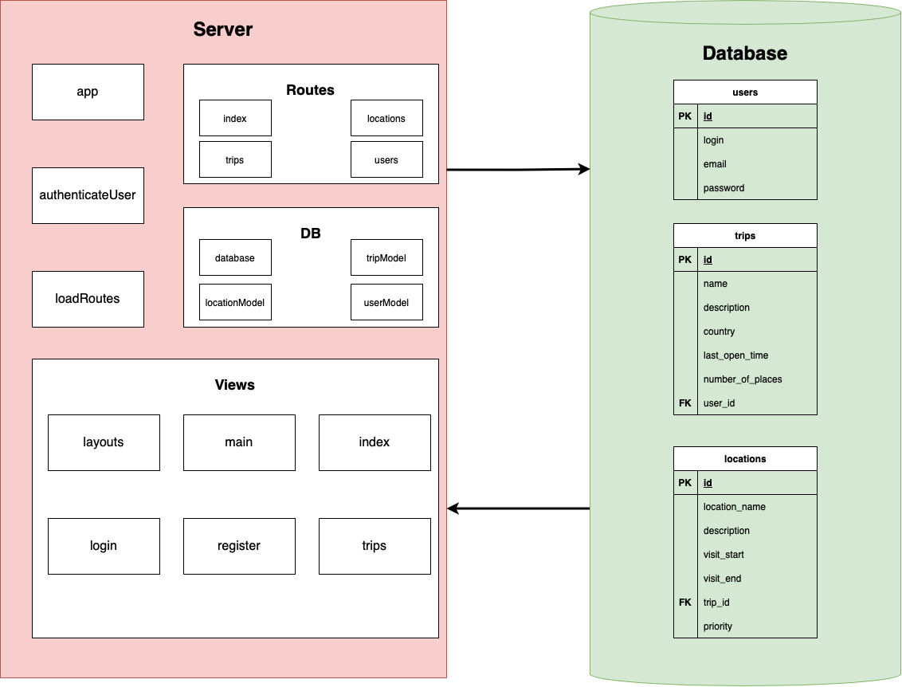
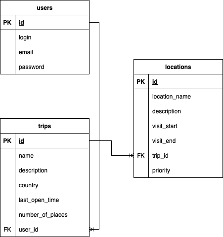

### Лабораторна робота №3: Розробка структури застосунку

#### Виконані завдання:

1. **Розроблено структуру компонентів ПЗ**:
   - Додаток поділено на такі основні частини:
     - **Server**: Серверна частина, реалізована за допомогою Node.js та Express.
     - **Database**: База даних для збереження інформації про користувачів, подорожі та локації.
     - **Views**: Шаблони для відображення сторінок, реалізовані з використанням Handlebars (HBS).
   - Результат представлено у вигляді діаграми компонентів:
     

2. **Описано дані та їх зв’язки**:
   - Розроблено ER-діаграму бази даних, яка включає три таблиці:
     - **users**: зберігає інформацію про користувачів.
     - **trips**: зберігає інформацію про подорожі, прив’язані до користувачів.
     - **locations**: зберігає інформацію про локації, прив’язані до подорожей.
   - ER-діаграма:
     
   - Зв’язки між таблицями:
     - `users.id → trips.user_id (1:N)`
     - `trips.id → locations.trip_id (1:N)`

---

#### **Опис логіки та маршрутів Backend**

1. **Маршрути для `users`**:
   - **`POST /users/register`**:
     - Реєструє нового користувача.
     - Хешує пароль і зберігає дані в таблиці `users`.
   - **`POST /users/login`**:
     - Аутентифікує користувача за логіном і паролем.
   - **`POST /users/logout`**:
     - Видаляє дані користувача з local storage та завершує сесію.

2. **Маршрути для `trips`**:
   - **`POST /trips`**:
     - Додає нову подорож для авторизованого користувача.
   - **`GET /trips`**:
     - Повертає всі подорожі авторизованого користувача.
   - **`DELETE /trips/:id`**:
     - Видаляє подорож за її `id`.
   - **`PUT /trips/:id`**:
     - Редагує подорож за її `id`.

3. **Маршрути для `locations`**:
   - **`POST /locations`**:
     - Додає нову локацію до бази даних, прив’язуючи її до подорожі.
   - **`DELETE /locations/:id`**:
     - Видаляє локацію за її `id`.
   - **`PUT /locations/:id`**:
     - Оновлює інформацію про локацію (наприклад, назву, опис, дати відвідування).

---

#### **Оновлення/зміни/агрегації даних**:

1. **Реєстрація та авторизація**:
   - Додавання нового користувача до таблиці `users`. Пароль хешується перед збереженням.
   - Авторизація користувача, що повертає токен авторизації.

2. **Робота з подорожами**:
   - Додавання нової подорожі створює запис у таблиці `trips` і автоматично прив’язує його до користувача.
   - Видалення подорожі також видаляє всі пов’язані локації.

3. **Робота з локаціями**:
   - Додавання нової локації додає запис до таблиці `locations` і пов’язує її з подорожжю.
   - Оновлення даних локації дозволяє змінювати дати та пріоритет.

4. **Отримання даних для клієнта**:
   - Дані про користувача, подорожі та локації агрегуються для передачі у Views.

---

#### **Висновок**:
- Розроблено маршрути Backend, які відповідають основним сценаріям роботи застосунку.
- Логіка роботи з даними охоплює реєстрацію, авторизацію, управління подорожами та локаціями.
- Зв’язки між таблицями дозволяють легко агрегувати дані для зручного використання у шаблонах.