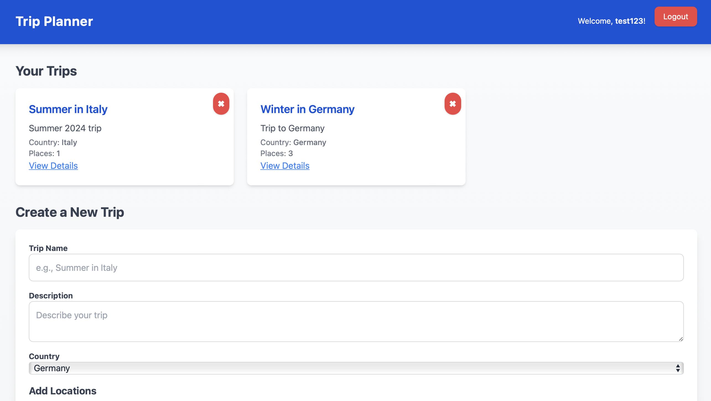

### Лабораторна робота №4: Імплементація інтерактивного прототипу

#### Виконані завдання:

1. **Реалізовано використання статичних даних на Backend**:

   - Додано mock-дані для роботи з користувачами та подорожами:

     - Mock-дані для користувачів:
       ```javascript
       const mockUsers = [
         { id: 1, login: 'user1', email: 'user1@example.com', password: 'password1' },
         { id: 2, login: 'user2', email: 'user2@example.com', password: 'password2' },
       ];
       ```
     - Mock-дані для подорожей:
       ```javascript
       const mockTrips = [
         { id: 1, name: 'Summer in Italy', description: 'Summer 2024 trip', country: 'Italy', last_opent_time, number_of_places: 1, user_id: 1 },
         { id: 2, name: 'Winter in Germany', description: 'Trip to Germany', country: 'Germany', last_opent_time, number_of_places: 3, user_id: 2 },
       ];
       ```

   - Адаптовано маршрути для роботи з mock-даними:

     - **Маршрути для користувачів:**
       - **`POST /users/register`**: Створює нового користувача.
       - **`POST /users/login`**: Авторизує існуючого користувача.

     - **Маршрути для подорожей:**
       - **`POST /trips/add`**: Додає нову подорож до mock-даних.
       - **`PUT /trips/:id/edit`**: Оновлює існуючу подорж.
       - **`DELETE /trips/:id/delete`**: Видаляє існуючу подорож.

2. **Інтеграція Views (HBS) для клієнту**:

   - Створено шаблон для відображення основної інформації [views/index.hbs](../../views/index.hbs):

     

   - Створено додаткові шаблони, наприклад для редагування вже існуючих подорожей [views/trips.hbs](../../views/trips.hbs):

     

3. **Додано функціонал для створення нових записів**:

   - **Подорожі**:
     - Форма для створення нової подорожі [views/index.hbs](../../views/index.hbs):
       ```hbs
       <form
            method='POST'
            action='/trips/add'
            class='bg-white p-6 rounded-lg shadow-lg'
          >
            <div class='mb-4'>
              <label
                for='name'
                class='block text-sm font-bold text-gray-700'
              >Trip Name</label>
              <input
                type='text'
                id='name'
                name='name'
                class='w-full p-3 border border-gray-300 rounded-lg focus:outline-none focus:ring-2 focus:ring-blue-500'
                placeholder='e.g., Summer in Italy'
                required
              />
            </div>
            <div class='mb-4'>
              <label
                for='description'
                class='block text-sm font-bold text-gray-700'
              >Description</label>
              <textarea
                id='description'
                name='description'
                class='w-full p-3 border border-gray-300 rounded-lg focus:outline-none focus:ring-2 focus:ring-blue-500'
                placeholder='Describe your trip'
                required
              ></textarea>
            </div>
            <div class='mb-4'>
              <label
                for='country'
                class='block text-sm font-bold text-gray-700'
              >Country</label>
              <select
                id='country'
                name='country'
                class='w-full p-3 border border-gray-300 rounded-lg focus:outline-none focus:ring-2 focus:ring-blue-500'
                required
              >
                <option value='Germany'>Germany</option>
                <option value='France'>France</option>
                <option value='Italy'>Italy</option>
                <option value='Spain'>Spain</option>
                <option value='Netherlands'>Netherlands</option>
                <option value='Sweden'>Sweden</option>
                <option value='Switzerland'>Switzerland</option>
              </select>
            </div>
            <div id='locations-container' class='mb-4'>
              <h3 class='text-lg font-bold text-gray-700 mb-3'>Add Locations</h3>
              <div
                class='location-item mb-4 p-4 bg-gray-50 border border-gray-300 rounded-lg shadow-sm'
              >
                <h4 class='text-md font-semibold text-gray-600 mb-2'>Location 1</h4>
                <input
                  type='text'
                  name='locations[0][name]'
                  placeholder='e.g., Eiffel Tower'
                  class='w-full p-3 border border-gray-300 rounded-lg focus:outline-none focus:ring-2 focus:ring-blue-500 mb-3'
                />
                <textarea
                  name='locations[0][description]'
                  placeholder='A brief description (optional)'
                  class='w-full p-3 border border-gray-300 rounded-lg focus:outline-none focus:ring-2 focus:ring-blue-500 mb-3'
                ></textarea>
                <div class='flex space-x-2 mb-3'>
                  <input
                    type='date'
                    name='locations[0][visitStart]'
                    class='w-1/2 p-3 border border-gray-300 rounded-lg focus:outline-none focus:ring-2 focus:ring-blue-500'
                  />
                  <input
                    type='date'
                    name='locations[0][visitEnd]'
                    class='w-1/2 p-3 border border-gray-300 rounded-lg focus:outline-none focus:ring-2 focus:ring-blue-500'
                  />
                </div>
                <input
                  type='number'
                  name='locations[0][priority]'
                  placeholder='Priority (1-5)'
                  class='w-full p-3 border border-gray-300 rounded-lg focus:outline-none focus:ring-2 focus:ring-blue-500 mb-3'
                />
                <button
                  type='button'
                  class='remove-location bg-red-500 text-white px-4 py-2 rounded-lg shadow hover:bg-red-600 transition'
                >
                  Remove Location
                </button>
              </div>
            </div>
            <button
              type='button'
              id='add-location'
              class='bg-green-500 text-white px-5 py-2 rounded-lg shadow hover:bg-green-600 transition'
            >
              Add Location
            </button>
            <button
              type='submit'
              class='bg-blue-500 text-white px-4 py-2 rounded-lg shadow hover:bg-blue-600 transition mt-4'
            >Create Trip</button>
          </form>
       ```
     - Маршрут у файлі [routes/trips.js](../../routes/trips.js):
       ```javascript
       router.post('/trips/add', (req, res) => {
         const { name, description, country } = req.body;
         const newTrip = { id: mockTrips.length + 1, name, description, country, last_opent_time, number_of_places, user_id: 1 };
         mockTrips.push(newTrip);
         res.redirect('/');
       });
       ```

#### Висновок:

- Додано підтримку mock-даних для користувачів та подорожей, які дозволяють працювати із застосунком без бази даних.
- Забезпечено інтеграцію mock-даних у HBS для відображення інформації на головній сторінці.
- Реалізовано функціонал для додавання нових подорожей через форму, використовуючи mock-дані.