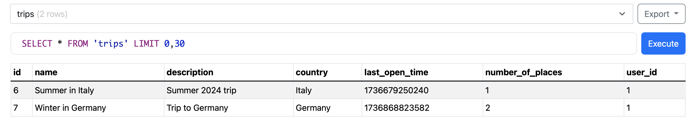

### Лабораторна робота №5: Імплементація інтеграції з віддаленими джерелами даних

#### Виконані завдання:

1. **Інтеграція з базою даних (SQLite):**
   - Реалізовано підключення до бази даних SQLite через файл `database.js`.
   - У базі даних створено таблиці:
     - **trips**: зберігає інформацію про подорожі.
     - **locations**: зберігає інформацію про локації, пов’язані з подорожами.
   - **SQL-запити для створення таблиць:**
     ```sql
     CREATE TABLE trips (
       id INTEGER PRIMARY KEY AUTOINCREMENT,
       name TEXT NOT NULL,
       description TEXT,
       country TEXT,
       last_open_time INTEGER,
       number_of_places INTEGER,
       user_id INTEGER NOT NULL,
       FOREIGN KEY (user_id) REFERENCES users(id)
     );

     CREATE TABLE locations (
       id INTEGER PRIMARY KEY AUTOINCREMENT,
       location_name TEXT NOT NULL,
       description TEXT,
       visit_start INTEGER,
       visit_end INTEGER,
       priority INTEGER,
       trip_id INTEGER NOT NULL,
       FOREIGN KEY (trip_id) REFERENCES trips(id)
     );
     ```

2. **Реалізація маршруту для роботи з таблицею `trips`:**
   - У файлі [routes/trips.js](../../routes/trips.js) реалізовано основні CRUD-операції для роботи з таблицею `trips`:
     - **`GET /`**: [Отримання всіх подорожей для авторизованого користувача](../../routes/trips.js#L7-L17):
       ```javascript
       db.all('SELECT * FROM trips WHERE user_id = ?', [user.id], (err, trips) => {
         if (err) {
           console.error('Database error:', err);
           return res.status(500).render('index', { title: 'Trip Planner', user, trips: [] });
         }
         res.render('index', { title: 'Trip Planner', user, trips });
       });
       ```
     - **`POST /add`**: [Додавання нової подорожі з автоматичним створенням локацій](../../routes/trips.js#L19-L81):
       ```javascript
       db.run(
         'INSERT INTO trips (name, description, country, last_open_time, number_of_places, user_id) VALUES (?, ?, ?, ?, ?, ?)',
         [name, description, country, Date.now(), number_of_places, user.id],
         function (err) {
           if (err) {
             return reject(err);
           }
           resolve(this.lastID);
         }
       );
       ```
     - **`GET /trip/:id`**: [Отримання деталей конкретної подорожі разом із локаціями](../../routes/trips.js#L83-L113):
       ```javascript
       db.get('SELECT * FROM trips WHERE id = ? AND user_id = ?', [tripId, user.id], (err, trip) => {
         db.all('SELECT * FROM locations WHERE trip_id = ?', [tripId], (err, locations) => {
           res.render('trips', { title: trip.name, user, trip, locations });
         });
       });
       ```
     - **`POST /trip/:id/delete`**: [Видалення подорожі разом із її локаціями](../../routes/trips.js#L115-L129):
       ```javascript
       db.run('DELETE FROM trips WHERE id = ? AND user_id = ?', [tripId, user.id], (err) => {
         db.run('DELETE FROM locations WHERE trip_id = ?', [tripId]);
       });
       ```
     - **`POST /trip/:id/edit`**: [Редагування подорожі та оновлення її локацій](../../routes/trips.js#L131-L194):
       ```javascript
       db.run(
         'UPDATE trips SET name = ?, description = ?, country = ?, last_open_time = ? WHERE id = ? AND user_id = ?',
         [name, description, country, Date.now(), tripId, user.id]
       );
       ```

3. **Перевірка роботи інтеграції:**
   - Дані успішно зчитуються з бази даних і передаються у шаблони HBS для відображення.
   - Додано функціонал для взаємодії з подорожами:
     - Створення нових подорожей.
     - Отримання списку подорожей користувача.
     - Видалення подорожей.
     - Оновлення інформації про подорожі.

---

#### **Скріншоти та демонстрація роботи:**
1. **Скріншот таблиці `trips`:**
   - 
2. **Скріншот списку подорожей на сторінці:**
   - 

---

#### Висновок:
- Реалізовано повноцінну інтеграцію з базою даних для роботи з подорожами.
- CRUD-операції забезпечують гнучкість у керуванні даними.
- Інтеграція дозволяє зберігати, оновлювати та видаляти інформацію в реальному часі, використовуючи базу даних SQLite.