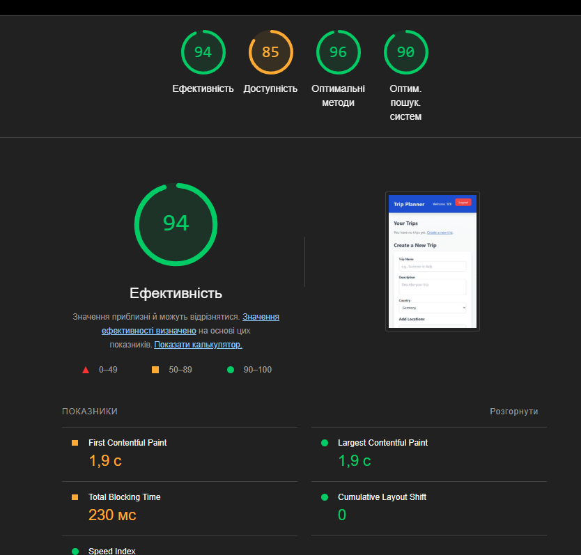
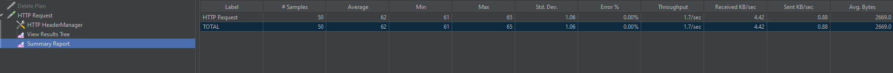

# Лабораторна робота №8: Перформанс

## 1. Аналіз Frontend за допомогою Lighthouse

Ціль: Оцінити продуктивність, доступність і SEO сайту на основі результатів тестів Lighthouse.

### Результат аналізу:

Основні показники (для Mobile):
Performance: 94
Accessibility: 85
Best Practices: 96
SEO: 90

### Основні проблеми:

1. Між кольорами фону та переднього плану недостатній коефіцієнт контрастності.
2. Елементи форми не мають пов’язаних міток

### Детальний звіт

## Навантажувальне тестування

Для цього я використав Apache Jmeter
### Результати тестування

### Висновок
1. Система стабільно працює при навантаженні до 50 одночасних користувачів.
2. Час відповіді можна оптимізувати, звернувши увагу на запити до бази даних і можливі затримки у виконанні запитів.
3. Jmeter підтвердив, що основні функції системи виконуються без помилок.

## Профайлінг

Профайлінг був виконаний за допомогою Apache Jmeter

[HTML file](./Reports/index.html)